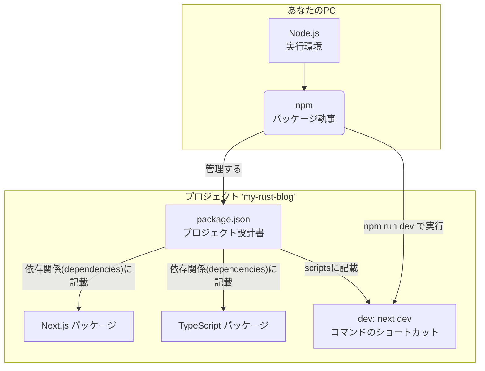
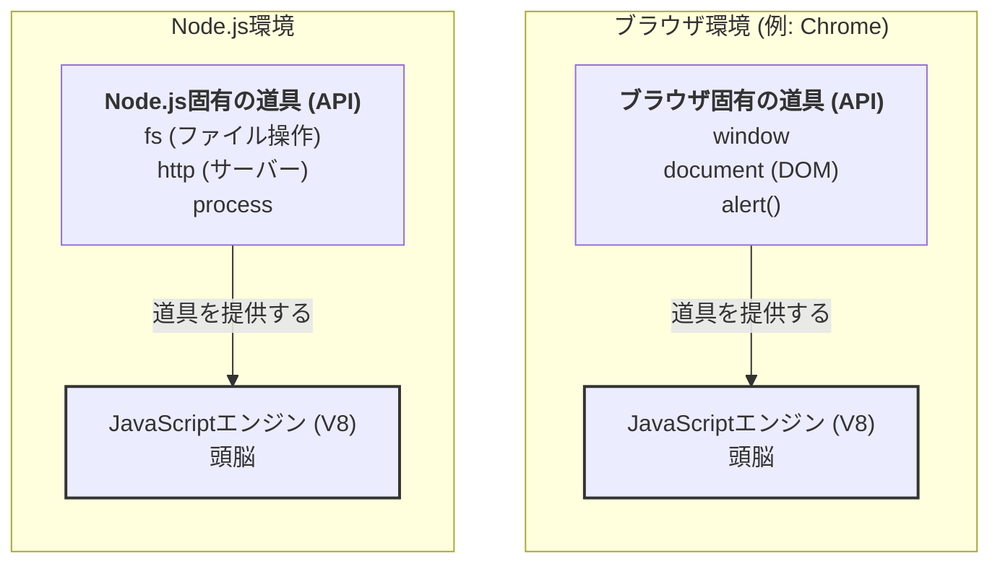
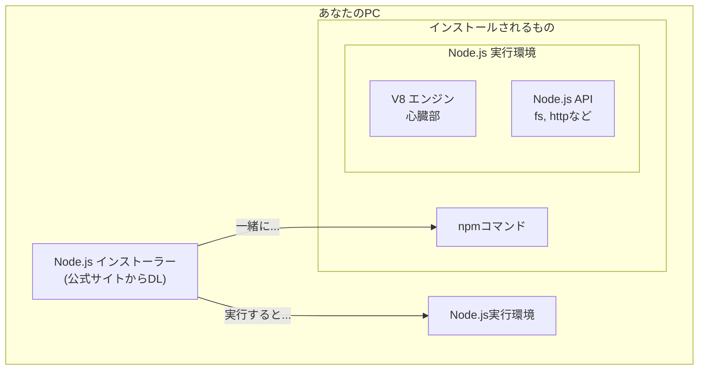
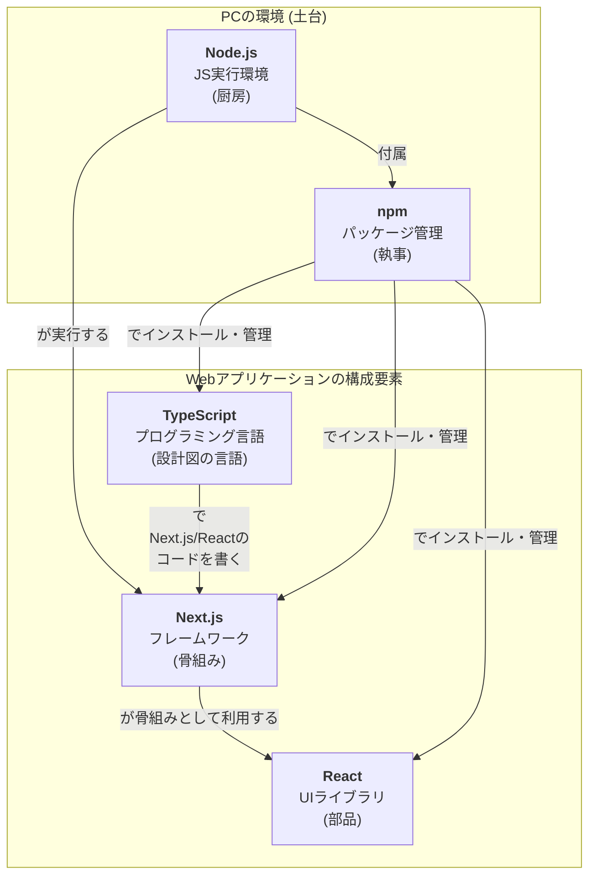

# 私の最初のブログ記事へようこそ！

これは、Next.js と Rust で構築するブログの最初の記事です。
Markdown 形式で書かれています。

## 開発の進捗

現在、フロントエンドの基本的なレイアウトが完成し、Markdown ファイルを読み込む準備を進めています。

### 次のステップ

- Markdown ファイルを読み込むユーティリティ関数の作成
- 記事一覧ページの作成
- 記事詳細ページの作成

楽しみにしていてください！

## 2025 年 10 月 27 日: Web 開発の基本構成要素

### npm と TypeScript の関係

`npm`はパッケージ管理ツールであり、`TypeScript`はプログラミング言語です。`npm`が`TypeScript`を扱うためのツールを管理します。

### ブラウザ環境と Node.js 環境の違い

どちらも同じ「V8」エンジンを搭載していますが、提供される API（道具）が異なるため、役割が異なります。

### Node.js, npm, V8 エンジンのインストール関係

`Node.js`をインストールすると、実行環境本体、心臓部である`V8`エンジン、パッケージ管理ツールである`npm`が一度に PC にセットアップされます。

### 5 つの主要技術の全体関係図

TypeScript, Node.js, Next.js, React, npm の役割と関係性を一枚にまとめた図です。

